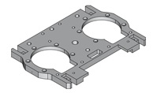
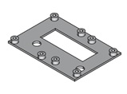

# Руководство по сборке робота Tinker

# Сборка ног

Ноги имеют зеркальную симметрию. Инструкция приведена для одной ноги, вторая собирается аналогично. 

## Сбока стопы

### Компоненты:
- Стопа
- Мотор DM-J6006 (CAN ID 5)
- Крепеж: 6 винтов M3x8

ВНИМАНИЕ: Длинные винты недопустимы и могут повредить обмотку мотора! 

3D модель детали "стопа":

### Шаги:

1. Определите левую и правую детали. Определите, с какой стороны робота у вас будет смотреть длинная часть детали

2. Установите мотор и закрутите по внутреннему диаметру на 6 винтов М3x8. 

### Итоговый результат:

  

## Сборка голени

### Компоненты:
- Собранная стопа 
- Голень
- Наполнитель голени 
- Мотор DM-J8006 (CAN ID 4)
- Шины питания и управления
- Крепеж: 5 винтов M3x8, 6 винтов М4x8, 4 винта М3x12, 4 гайки М3

ВНИМАНИЕ: Длинные винты недопустимы и могут повредить обмотку мотора! 

3D модель детали "голень":

3D модель детали "наполнитель голени":

### Шаги:

1. Проверните мотор на стопе так, чтобы его разъем был доступен для подключения.

2. Подключите шины питания и управления к мотору соответсвующими выводами.

3. Приложите к мотору стопы DM-J6006 (CAN ID 5) голень и прикрутите на 5 винтов М3x8. Выводы шины не должны быть пережаты, необходимо чтобы они беспрепятственно проходили в углубление.

    

      
    

4. Проложите шину по Т-образному каналу голени. Выведите через тот канал, который соотвествует передней стороне робота (по ближайшей траектории к будущему бедру). Нельзя чтобы провода накладывались друг на друга, иначе они будут выступать из углубления и мешать повороту мотора.

5. Прикрутите мотор DM-J8006 (CAN ID 4) на 6 винтов М4x8 к голени по внутреннему диаметру. Проверьте у мотора возможность свободно вращаться. В противном случае снимите мотор и исправьте прокладку проводов.
 
    

      
    

6. Установите наполнитель на собранную конструкцию. Радиусы скругления детали отличаются с двух сторон, поэтому установите меньший диаметр в строну меньшего мотора стопы DM-J6006, а больший диаметр в сторону большего мотора DM-J8006. Проверьте свободность вращения суставов.

7. Прикрутите наполнитель голени на 4 винта М3x12.

8. Затяните 4 гайки М3 с обратной стороны наполнителя голени. 

### Итоговый результат:

  

  

## Сборка бедра

### Компоненты:
- Полусобранная нога с голенью
- Бедро
- Наполнителя бедра
- Мотор DM-J8006 (CAN ID 3)
- Крепеж: 14 винтов М4x8, 2 винта М3х16, 2 винта М3х10, 4 гайки М3 

ВНИМАНИЕ: Длинные винты недопустимы и могут повредить обмотку мотора! 

3D модель детали "бедро":

3D модель детали "наполнитель бедра":

### Шаги:

1. Установите бедро на ранее собранную голень. Примерьте мотор DM-J8006 (CAN ID 3). Если ваша шина заранее собрана, убедитесь, что подключение свободно проходит в заложенные проходы под разъемы. Если нет, попробуйте провернуть бедро на 180 градусов, примерить бедро от другой ноги или проверить правильность подключения шины, или сборку ног.

2. Выставьте оба мотора (3 и 4) так, чтобы их разъемы смотрели друг на друга внутри бедра.

3. Перебросьте проводку выходящую с голени на основную часть бедра в соотвествующие ей каналы.

4. Прикрутите бедро к голени через мотор DM-J8006 (CAN ID 4) на 7 винтов M4x8 по внешнему диаметру

5. Прикрутите мотор DM-J8006 (CAN ID 3) к основной части бедра на 7 винтов M4x8 по внешнему диаметру.

    

      
    

6. Примерьте наполнитель бедра. Наполнитель бедра работает как стопор и отвечает за диапазон сгибания голени. Определите, в какую сторону и как должна сгибаться нога.
    
    В стандартной сборке ноги должны полностью сгибаться при попытке присесть "коленями назад" и быть ограничены стопором при попытке согнуть ногу и присесть "коленями вперед".

7. Прикрутите наполнитель бедра. Выходы проводов должны проходить через отверстия в крышке. При этом 2 винта, вкручивающиеся в толстые места - М3х16, а 2 винта вкручивающиеся в тонкие - М3х10.

8. Затяните 4 гайки М3 с обратной стороны наполнителя бедра. 

### Итоговый результат:

  

## Сборка таза ноги

### Компоненты:
- Полусобранная нога с бедром
- Кость тазовая
- Прокладка тазовая
- Крепеж: 4 винта М4x10

ВНИМАНИЕ: Длинные винты недопустимы и могут повредить обмотку мотора! 

3D модель детали "кость тазовая":

3D модель детали "прокладка тазовая":

### Шаги:

1. Проденьте 4 винта М4x10 с тазовой прокладкой на малой поверхности тазовой кости как показано на изображении.

    

      
    

2. Прикрутите полученную заготовку к полусобранной ноге по внутреннему диаметру мотора DM-J8006 (CAN ID 3)

### Итоговый результат:

  

Вторая нога собирается по аналогии.

На этом сборка ног окончена.

# Сборка туловища

## Установка моторов на крышку корпуса

### Компоненты:
- Крышка корпуса
- Держатель таза - 2 штуки
- Моторы DM-J6006 (CAN ID 1) - 2 штуки
- Крепеж:  12 винтов М3x5 и 10 винтов М3x10

3D модель детали "крышка корпуса":

3D модель детали "держатель таза":

### Шаги:

1. Установите моторы DM-J6006 (CAN ID 1) на крышку корпуса по внешнему диаметру на 6 винтов М3x5 каждый (всего 12).

  

    
  

2. Прикрутите держатели таза к моторам DM-J6006 (CAN ID 1) по внутреннему диаметру на 5 винтов М3x10 на каждый мотор (всего 10 винтов).

  

    
  

### Итоговый результат:

  

## Сборка реберного каркаса

### Компоненты:
- Крышка корпуса
- Ребро переднее - 2 штуки
- Ребро заднее - 2 штуки
- Расширитель рюкзака - 2 штуки
- Нижняя опора (булка) - 2 штуки
- Днище корпуса
- Ручка (?) (нет CAD)
- Плата питания
- Крепеж:  4 винта М3x18, 4 винта М5x16, 4 винта М3x8, 4 винта М3x12

3D модель детали "ребро заднее":

3D модель детали "ребро переднее":

3D модель детали "расширитель рюкзака":

3D модель детали "булка":

3D модель детали "днище корпуса":

### Шаги:

1. Соберите 2 подсборки, каждая из которых состоит из заднего ребра, расширителя рюкзака и 2 винтов М3x18

    

      
    

2. Установите нижние опоры (булки) на днище корпуса на 4 винта М5x16

    

      
    

3. На основание устанавливается плата питания на 4 винта М3x8. На нее приходит 24В с аккумулятора через разъемы XT30, 24В идут на моторы. Через понижающие преобразователи с оставшихся разъемов XT30 пониженное напряжение идет на все остальные платы

    

      
    

4. Прикручиваем передние ребра к днищу корпуса на 2 винта М3x12

    

      
    

5. Прикручиваем задние ребра с расширителями к днищу корпуса на 2 винта М3x12

### Итоговый результат:

  

    
  

## Сборка нагрудника с батареей 

### Компоненты:
- Нагрудник
- Батарея
- Скамейка - 2 штуки
- Прокладка-заполнитель
- Выключатель
- Крышка тумблера
- Крепеж: 4 винта М3x10, 2 винта М3x12

3D модель детали "нагрудник":

3D модель детали "скамейка":

### Шаги:

1. Подключите провода к батарее.

    

      
    

2. Установите батарею в нагрудник

3. Прижмите нагрудник прокладкой-заполнителем

4. Закрепите конструкцию двумя скамейками на 4 винтах М3x10

5. Установите выключатель, подключенный к батареи на верхнюю часть нагрудника.

    

      
    

6. Закрепите крышку тумблера на 2 винта М3x12.

### Итоговый результат:

  

## Сборка пластины рюкзака с платами

### Компоненты:
- Пластина
- Рамка рюкзака
- Кассета 1 (для одноплатного компьютера)
- Кассета 2 (для роутера и платы конвертора)
- Роутер
- Плата конвертора
- Одноплатный компьютер Odroid
- Jetson Nano
- Крепеж:  7 винтов М3x10, 4 винта М3x8, 4 винта М3x12 

3D модель детали "пластина":

3D модель детали "рамка рюкзака":

3D модель детали "кассета1" (для одноплатного компьютера):

3D модель детали "кассета2" (для роутера и платы конвертора):

### Шаги:

1. Установите плату конвертора и роутер через касету 2 на пластину на 7 винтов М3x10

    

      
    

2. Установите одноплатный компьютер Odroid через касету 1 на пластину на 4 винта М3x8

    

      
    

3. Прикрепите рамку рюкзака с платой Jetson Nano с обратной стороны пластины на 4 винта М3x12 

    

      
    

### Итоговый результат:

  

    
  

## Окончательная сборка узлов

### Компоненты:

- Крышка корпуса
- Рукоятка туловища
- Мотор DJ-8006 (CAN ID 2) - 2 штуки
- Реберный каркас
- Нагрудник с батареей 
- Пластина рюкзака с платами
- Рюкзак
- Крышка рюкзака
- Собранные левая и правая ноги
- Крепеж: 12 винтов М4x8, 10 винтов М4x12, 2 винта М4x16, 10 винтов М3x10, 6 винтов М3x8. 

3D модель детали "рюкзак":

3D модель детали "крышка рюкзака":

### Шаги:

1. Закрепите рукоятку туловища на крышку корпуса с малыми моторами DJ-6006 (CAD ID 1) на 2 винта М4x16

2. Прикрепите на крышку корпуса через тазовый держатель моторы DJ-8006 (CAD ID 2) по внешнему диаметру, каждый на 5 винтов М4x12 (всего 10)   

3. Полученную крышку с моторами и рукоятью присоедините к реберному каркасу на 4 винта М3x10.

    

      
    

4. Закрепите нагрудник с батареей к реберному каркасу на 6 винтов М3x10.

    

      
    

5. Закрепите пластину с платами к реберному каркасу через расширители рюкзака на 4 винта М3x12.

    

      
    

6. Закрепите рюкзак к пластине на 4 винта М3x8

7. Закрепите крышку рюкзака к рюкзаку на 2 винта М3x8

8. Закрепите ноги через тазовую кость и моторы DJ-8006 (CAD ID 2) по внутреннему диаметру, каждая на 6 винтов М4x8 (всего 12).

    

      
    

# Использованные источники при написании документа

## Ссылки на оригинальные репозитории (китайский):

- https://github.com/Yuexuan9/Tinker
- https://github.com/golaced/OmniBotSeries-Tinker
- https://github.com/opensourcerobot/Alpha_Human_gym

## Старые наработки по сборке:
- https://docs.google.com/document/d/1pkIk8nil-tea-ONIwO6mQMsns4i3d3h6Fau9hqrktOM/edit?tab=t.0

## Документация по сборке, оформленная на челлендже по робототехнике в МИРЭА (20.09.2025):

- https://docs.google.com/document/d/1XzRPR8T_qbFmMlUTiFXh5atXuQTEibNgBgT0nuE3rxs/edit?tab=t.0#heading=h.oq30rhmcy015 (оранжевый)

- https://github.com/DmitryRastiK/Challenge-Tinker/tree/robot-assembly-instructions-chill-guys (черный)

- https://docs.google.com/document/d/1N3q0X6C2agBjJ6bhG8ADhrkL4QRYzZ-sPkh70jUnhQA/edit?tab=t.0 (черно-белый)
