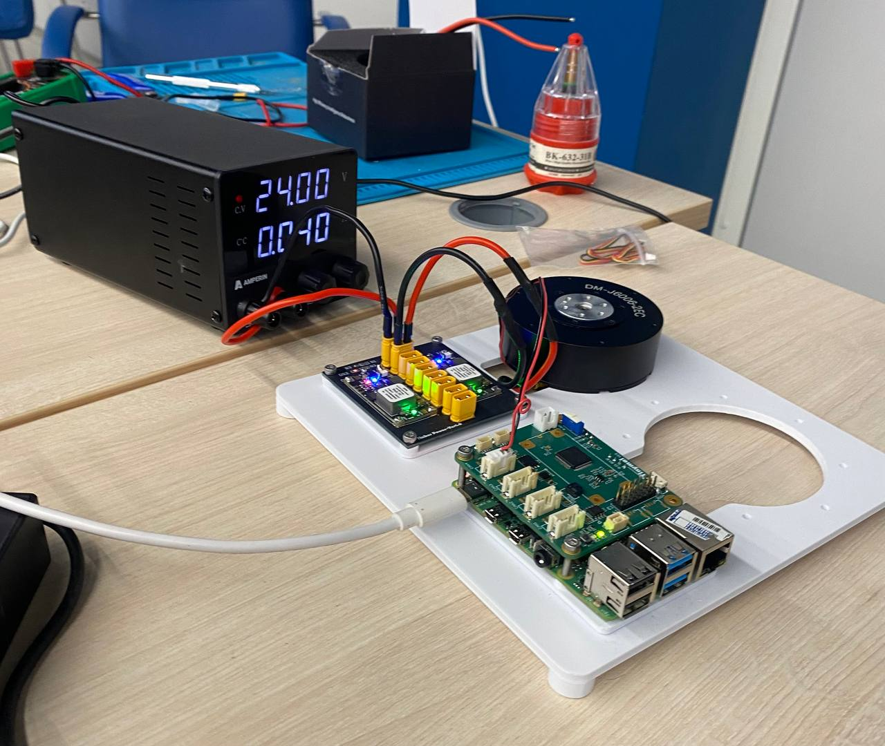

## Tinker Robot (ROS 2 Jazzy)

This is result of 20.09.2025 Hackaton in MIREA about Tinker robot. 
This repo contains solution of 🐧 (penguin) team (2 track):
- https://github.com/kaizer-nurik
- https://github.com/pendragon707
- https://github.com/Dexly4 
- Artem
- https://github.com/misaklockov78084-ux

High-performance motor control and visualization stack for the Tinker robot, built on ROS 2 Jazzy. This repository contains the robot description (URDF), RViz visualization, and a real-time motor control node. Contact @USSRnurik (telegram) if support is needed.



### TL;DR
- Clone this repo into your ROS 2 workspace `~/ws/src`
- Build with colcon using symlinks for fast iteration
- Run the motor node and/or launch visualization in RViz

```bash
# 1) Setup environment (Ubuntu / ROS 2 Jazzy)
source /opt/ros/jazzy/setup.bash

# 2) Create workspace and place this repo inside
mkdir -p ~/ws/src
# Place/clone this repository into: ~/ws/src/Challenge-Tinker

# 3) Install dependencies (recommended)
cd ~/ws
rosdep install --from-paths src --ignore-src -r -y

# 4) Build
colcon build --symlink-install

# 5) Source the overlay (do this in every new terminal)
source ~/ws/install/setup.bash
```

---

## Packages in this repository
- `tinker_description`: URDF model, meshes, and RViz launch.
- `motor_control`: Motor control node and related logic.
- `hardware_msg`: Custom message definitions used by the system.

## Run

### 1) Motor node
After building and sourcing:

```bash
ros2 run motor_control Motor_control
```

### 2) Visualization (RViz)
Launch the RViz setup that loads the URDF and publishers:

```bash
ros2 launch tinker_description display.launch.py
```

If RViz does not auto-load a config, it will still bring up the model. You can save/load your own RViz config as needed.

---

## Networked setup (Raspberry Pi + Laptop)

If you run the motor node on a Raspberry Pi and RViz on a laptop, ensure both machines use the same ROS 2 domain.

- Both machines must have the same `ROS_DOMAIN_ID`.
- Do this in every terminal (or add to your shell profile) on both machines:

```bash
export ROS_DOMAIN_ID=7   # pick any number 0-232; must match on both
```

Optional: persist this setting
```bash
echo 'export ROS_DOMAIN_ID=7' >> ~/.bashrc
```

Then (on each machine) source ROS and your workspace before running nodes:
```bash
source /opt/ros/jazzy/setup.bash
source ~/ws/install/setup.bash
```

Now start the motor node on the Pi and RViz on the laptop as described above.

---

## ROS 2 packages overview

- `hardware_msg`
  - Provides typed interfaces for parameters, commands, states, IMU, and motor data.
  - Messages: `BoardParameters`, `Imu`, `ImuParameters`, `MotorData`, `MotorParameters`, `MotorsCommands`, `MotorsStates`.
- `motor_control`
  - Real-time node interfacing with the hardware via SPI, bridging to ROS 2 topics.
  - Subscribes to commands/parameters; publishes IMU, motor state, and `sensor_msgs/JointState` for visualization.
- `tinker_description`
  - URDF and RViz launch (`display.launch.py`). Publishes TF via `robot_state_publisher` and accepts `/robot_joints` for visualization.

---

## Custom message types (hardware_msg)

Message schemas as defined in `hardware_msg/msg`:

```text
# BoardParameters.msg
float32 beep_state
```

```text
# Imu.msg
float32 pitch
float32 roll
float32 yaw
```

```text
# ImuParameters.msg
bool acc_calibrate
bool msg_calibrate
bool gyro_calibrate
```

```text
# MotorData.msg
uint8 id
bool connect
bool motor_connected
bool ready
```

```text
# MotorParameters.msg
bool enable
bool reset_zero
bool reset_error
float32 kp
float32 kd
```

```text
# MotorsCommands.msg
float32 target_pos
float32 target_vel
float32 target_trq
```

```text
# MotorsStates.msg
float32 current_pos
float32 current_vel
float32 current_trq
```

---

## Topics used by motor_control

The `motor_control` node subscribes and publishes the following topics (see `motor_control/src/Motor_control.cpp`). Timer period is ~1 ms.

| Topic | Direction | Type | Purpose |
|---|---|---|---|
| `motor/params` | Subscribe | `hardware_msg/MotorParameters` | Enable/disable motor, reset flags, set gains `kp`, `kd` |
| `motors/commands` | Subscribe | `hardware_msg/MotorsCommands` | Command target position/velocity/torque for motor with `MOTOR_ID` |
| `control_board/commands` | Subscribe | `hardware_msg/BoardParameters` | Control-board parameters (e.g., beep) |
| `imu/commands` | Subscribe | `hardware_msg/ImuParameters` | IMU calibration controls |
| `imu/data` | Publish | `hardware_msg/Imu` | Euler angles roll/pitch/yaw from hardware |
| `motors/states` | Publish | `hardware_msg/MotorsStates` | Current pos/vel/trq for `MOTOR_ID` |
| `motor/data` | Publish | `hardware_msg/MotorData` | Connectivity and ready status for `MOTOR_ID` |
| `/robot_joints` | Publish | `sensor_msgs/JointState` | Positions for URDF visualization (first joint driven by motor state) |

Notes:
- `MOTOR_ID` is defined in `motor_control/src/Motor_control.cpp` and selects which motor index is driven/observed.
- `robot_state_publisher` is remapped to consume `/robot_joints` from the motor node.

---

## Sample pub/sub commands (terminal)

Ensure your workspace is built and sourced in the current terminal:
```bash
source ~/ws/install/setup.bash
```

### Publish motor parameters (enable and set gains)
```bash
ros2 topic pub --once /motor/params hardware_msg/msg/MotorParameters "{enable: true, reset_zero: false, reset_error: false, kp: 10.0, kd: 1.0}"
```

### Publish motor commands (position/velocity/torque)
Single-shot:
```bash
ros2 topic pub --once /motors/commands hardware_msg/msg/MotorsCommands "{target_pos: 0.0, target_vel: 0.0, target_trq: 0.0}"
```
Stream at 10 Hz:
```bash
ros2 topic pub -r 10 /motors/commands hardware_msg/msg/MotorsCommands "{target_pos: 0.0, target_vel: 0.0, target_trq: 0.0}"
```

### Control board and IMU commands
Beep (example):
```bash
ros2 topic pub --once /control_board/commands hardware_msg/msg/BoardParameters "{beep_state: 1.0}"
```
IMU calibration (example):
```bash
ros2 topic pub --once /imu/commands hardware_msg/msg/ImuParameters "{acc_calibrate: true, gyro_calibrate: false, msg_calibrate: false}"
```

### Subscribe (listen) to telemetry
IMU data:
```bash
ros2 topic echo /imu/data
```
Motor state (pos/vel/trq):
```bash
ros2 topic echo /motors/states
```
Motor connectivity/ready:
```bash
ros2 topic echo /motor/data
```
JointState for URDF visualization:
```bash
ros2 topic echo /robot_joints
```

Optional: check message types and rates
```bash
ros2 interface show hardware_msg/msg/MotorParameters
ros2 interface show hardware_msg/msg/MotorsCommands
ros2 topic hz /motors/states
```

## Sending commands to the motor (examples)

Publish parameters (enable/reset/kp/kd):
```bash
ros2 topic pub /motor/params hardware_msg/msg/MotorParameters "{enable: true, reset_zero: false, reset_error: false, kp: 10.0, kd: 1.0}"
```

Publish target commands (position/velocity/torque):
```bash
ros2 topic pub /motors/commands hardware_msg/msg/MotorsCommands "{target_pos: 0.0, target_vel: 0.0, target_trq: 0.0}"
```

Tip: In separate terminals, you can echo topics to verify data flow:
```bash
ros2 topic echo /motor/params
ros2 topic echo /motors/commands
```

---

## Configuration you likely need to change

### A) Motor ID (if the motor does not respond)
Update the motor CAN/ID in the motor node source. Open:
- `motor_control/src/Motor_control.cpp`

Look for a definition like:
```cpp
#define MOTOR_ID 0
```
Set it to the ID that matches your hardware, rebuild, and rerun:
```bash
cd ~/ws
colcon build --symlink-install
source ~/ws/install/setup.bash
ros2 run motor_control Motor_control
```

### B) Mesh paths in the URDF
By default the URDF may contain absolute `file://` mesh paths. Update them to your system, or (recommended) switch to `package://` URIs so they work on any machine once the package is in the workspace.

File to edit:
- `tinker_description/urdf/tinker_urdf.urdf`

Example: change something like
```xml
<mesh filename="file:///home/youruser/Challenge-Tinker/src/tinker_description/meshes/base_link.STL"/>
```
to
```xml
<mesh filename="package://tinker_description/meshes/base_link.STL"/>
```

Then rebuild and relaunch RViz if needed.

---

## Build details

### Workspace layout
- Place this repo at: `~/ws/src/Challenge-Tinker`
- Build from workspace root: `~/ws`

### Build commands
```bash
cd ~/ws
colcon build --symlink-install
source ~/ws/install/setup.bash
```

### Dependencies
- ROS 2 Jazzy (tested)
- `robot_state_publisher`, `rviz2`, `joint_state_publisher_gui` (installed via rosdep or apt)

If you skipped rosdep:
```bash
sudo apt update
sudo apt install ros-jazzy-robot-state-publisher ros-jazzy-rviz2 ros-jazzy-joint-state-publisher-gui
```

---

## Troubleshooting

### 1) Raspberry Pi (2 GB) runs out of memory while compiling
Create a swap file to provide additional virtual memory (example: 4 GB):
```bash
sudo fallocate -l 4G /swapfile
sudo chmod 600 /swapfile
sudo mkswap /swapfile
sudo swapon /swapfile
free -h
```
Make it persistent across reboots by adding a line to `/etc/fstab`:
```bash
echo '/swapfile none swap sw 0 0' | sudo tee -a /etc/fstab
```
After compiling, you can turn swap off if you prefer:
```bash
sudo swapoff /swapfile   # optional
```

### 2) Visualization shows no robot or broken meshes
- Ensure URDF mesh paths are valid (prefer `package://tinker_description/...`).
- Confirm you sourced the workspace: `source ~/ws/install/setup.bash`.
- Check RViz fixed frame matches your URDF (commonly `base_link`).

### 3) Motor node starts but motor is idle
- Set the correct `MOTOR_ID` and rebuild.
- Verify power and communication bus.
- Publish `MotorParameters` with `enable: true` (see examples above).

### 4) Cannot find packages or executables
- Did you place the repo in `~/ws/src` and run `colcon build --symlink-install`?
- Did you source `~/ws/install/setup.bash` in the current terminal?

---

## Development tips
- Build often with `--symlink-install` and keep a terminal sourced to your `install` overlay.
- Use separate terminals for RViz and the motor node to keep logs readable.
- Use `ros2 topic list`, `ros2 interface show <msg>`, and `ros2 node info <node>` to introspect the graph.

---

